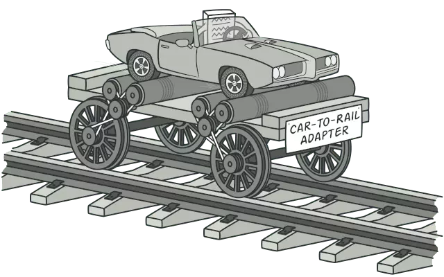
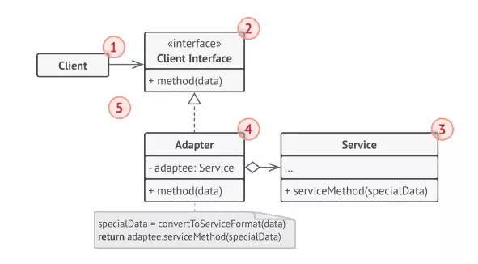
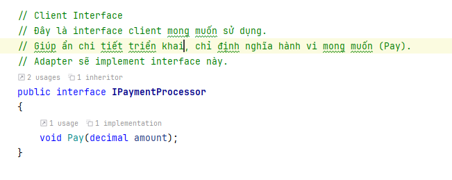
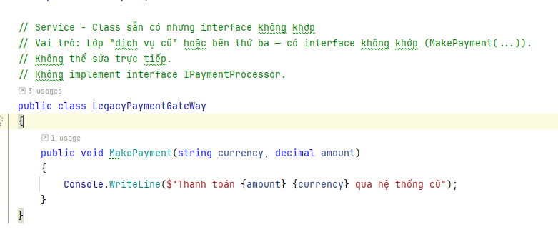
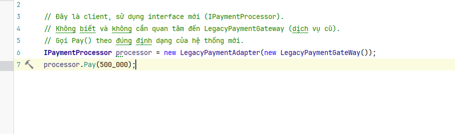

- [1. Khái niệm](#1-khái-niệm)
- [2. Cấu trúc (Object Adapter (Composition))](#2-cấu-trúc-object-adapter-composition)
- [3. Thực hành](#3-thực-hành)
- [4. Kết luận](#4-kết-luận)

# 1. Khái niệm

- Là một pattern thuộc nhóm structural giúp chuyển đổi interface của một class thành một interface khác mà client mong muốn.
- Adapter đóng vai trò là cầu nối giữa các class có interface không tương thích. Cho phép 2 khuôn mẫu không liên quan làm việc cùng nhau.
- Adapter Pattern giữ vai trò trung gian giữa hai lớp, chuyển đổi interface của một hay nhiều lớp có sẵn thành một interface khác, thích hợp cho lớp đang viết. Điều này cho phép các lớp có các interface khác nhau có thể dễ dàng giao tiếp tốt với nhau thông qua interface trung gian, không cần thay đổi code của lớp có sẵn cũng như lớp đang viết.

# 2. Cấu trúc (Object Adapter (Composition))

- Client là một class chứa business logic của chương trình
- Client interface mô tả một giao thức mà các lớp khác phải tuân theo để có thể collab với client code
- Service: là một class hữu ích (thường là bên thứ 3 hoặc kế thừa). Client không thể sử dụng trực tiếp lớp này vì nó có interface không tương thích.
- Adapter: là một class có thể hoạt động với cả client và service: nó implements client interface, trong khi đóng gói service object. Adapter khi được gọi từ Client thông qua Adapter Interface sẽ chuyển chúng thành các cuộc gọi service object được bao bọc ở định dạng mà nó có thể hiểu được.

# 3. Thực hành

Bạn có một hệ thống mới mong muốn gọi Pay(decimal amount) để thực hiện thanh toán, nhưng hệ thống cũ (hoặc bên thứ ba) chỉ cung cấp MakePayment(string currency, decimal amount). Bạn không thể hoặc không muốn sửa đổi lớp cũ.

# 4. Kết luận

- Ưu điểm:
  - Cho phép tận dụng lại các class sẵn có, không cần chỉnh sửa.
  - Client chỉ phụ thuộc vào interface chuẩn, không quan tâm đến logic cũ.
  - Dễ dàng "wrap" các thư viện, hệ thống ngoài có API không khớp.
- Nhược điểm:
  - Vì phải gọi qua thêm một lớp trung gian, có thể hơi tốn CPU/RAM.
  - Dễ rối nếu có quá nhiều adapter cho nhiều dịch vụ khác nhau.
  - Nếu logic giữa hai interface mâu thuẫn quá sâu, adapter có thể không giải quyết được.
