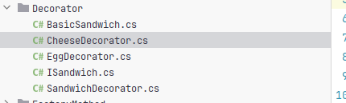
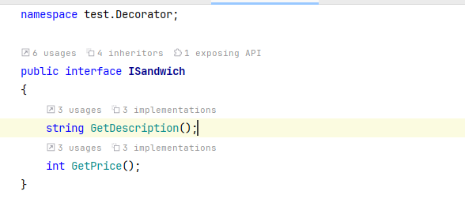
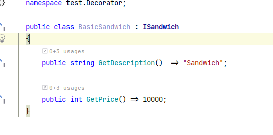
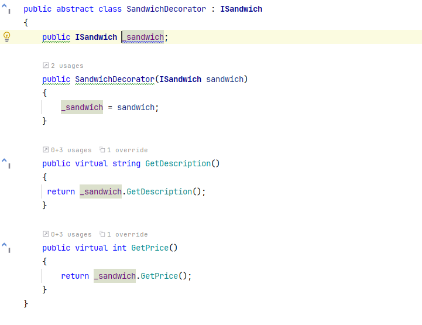
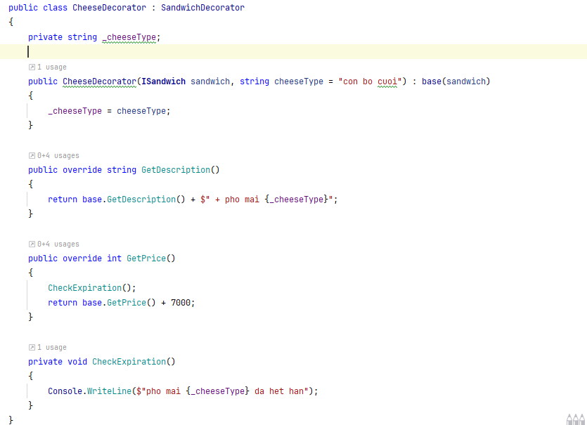
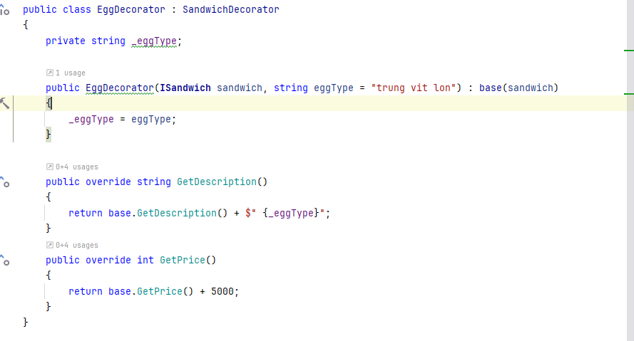
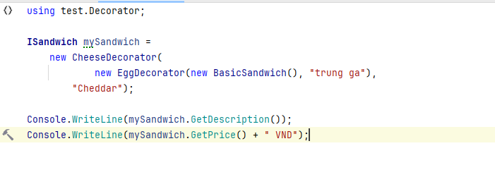
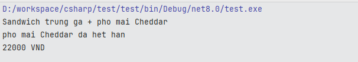

- [1. Khái niệm](#1-khái-niệm)
- [2. Cấu trúc](#2-cấu-trúc)
- [3. Thực hành](#3-thực-hành)
- [4. Tổng kết](#4-tổng-kết)

# 1. Khái niệm

- Decorator là Design Pattern thuộc nhóm Cấu trúc (Structural Pattern)
- Pattern cho phép thêm hành vi mới cho một đối tượng mà không làm thay đổi cấu trúc lớp gốc của nó
- Nó giống như việc "gói" một đối tượng trong một lớp khác, rồi bổ sung chức năng một cách linh hoạt, thay vì phải kế thừa và override phức tạp.

# 2. Cấu trúc


- `Component`: là một interface hoăc abstract class, định nghĩa Operation() method
- `ConcreteComponent`: implement Component, là đối tượng gốc, chưa được decor bất kì tính năng bổ sung nào
- `Decorator`: là abstract class kế thừa Component, giữ một tham chiếu đến Component
- `ConcreteDecoratorA` và `ConcreteDecoratorB`: Là những lớp cụ thể dùng để thêm hoặc mở rộng hành vi cho đối tượng gốc (`ConcreteComponent`) theo từng chức năng riêng biệt

--> Mục đích của cấu trúc này: cho phép bạn thêm hành vi vào đối tượng một cách linh hoạt, mà không thay đổi code gốc, không dùng kế thừa cứng nhắc.
Tuân thủ nguyên lý Open/Closed Principle: mở rộng được nhưng không sửa đổi lớp có sẵn.

# 3. Thực hành

















- `ISandwich`: Interface gốc định nghĩa các hành vi chung: `GetDescription()` và `GetPrice()`
- `BasicSandwich`: ConcreteComponent – cung cấp logic cơ bản cho 1 chiếc bánh
- `SandwichDecorator`: Abstract Decorator – giữ 1 `ISandwich` bên trong, định nghĩa phương thức virtual
- `EggDecorator`:`ConcreteDecoratorA` – thêm trứng (\_eggType) vào mô tả + cộng tiền
- `CheeseDecorator`: `ConcreteDecoratorB` – thêm phô mai + kiểm tra hạn sử dụng (addedState + behavior)

- Luồng:

  - Giả sử có

  ```c#
  ISandwich mySandwich = new EggDecorator(new BasicSandwich(), "trung ga");
  ```

  - Khi gọi `mySandwich.GetDescription();` Luồng chạy như sau

    - Gọi EggDecorator.GetDescription()

    - Gọi base.GetDescription() → chạy SandwichDecorator.GetDescription()

    - Trong đó gọi \_sandwich.GetDescription() → chính là BasicSandwich.GetDescription() trả về "Sandwich"

    - Sau đó " + Fried egg" được thêm vào → kết quả: "Sandwich + trung ga"

# 4. Tổng kết

- Ưu điểm:

  - Bạn có thể mở rộng sandwich mà không sửa BasicSandwich
  - Có thể kết hợp nhiều lớp mở rộng theo thứ tự bất kỳ
  - Mỗi decorator chỉ lo một việc: trứng, phô mai, log, v.v

    -> Tuân thủ nguyên lý (Open/Closed): có thể mở rộng chức năng của đối tượng mà không cần sửa mã gốc.<br/>
    -> Có thể "xếp chồng" nhiều decorator để tạo tổ hợp hành vi khác nhau.Mỗi decorator làm 1 việc → dễ bảo trì, dễ test đơn lẻ.<br/>
    -> Thân thiện với unit test: Có thể mock từng decorator để kiểm thử riêng từng chức năng.<br/>

- Nhược điểm:<br/>
  -> Gây khó hiểu khi xếp chồng nhiều decorator <br/>
  -> Nếu thứ tự decorator ảnh hưởng kết quả, việc cấu hình sai thứ tự dễ gây lỗi logic. <br/>
