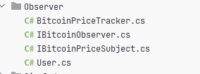
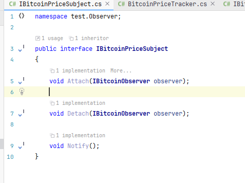
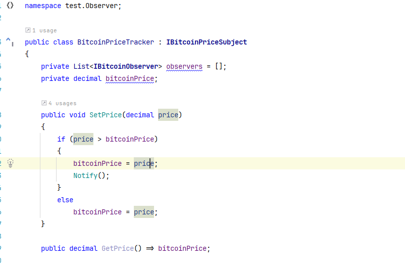
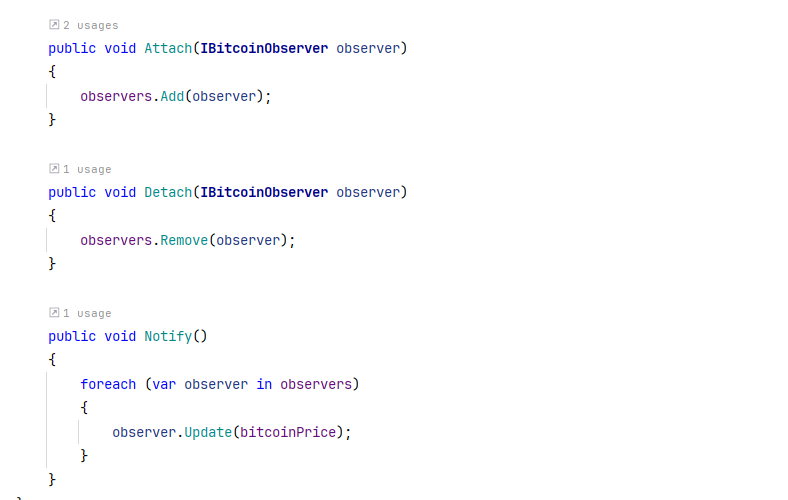
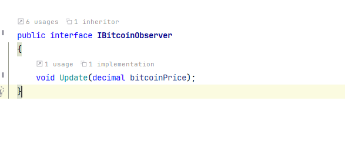
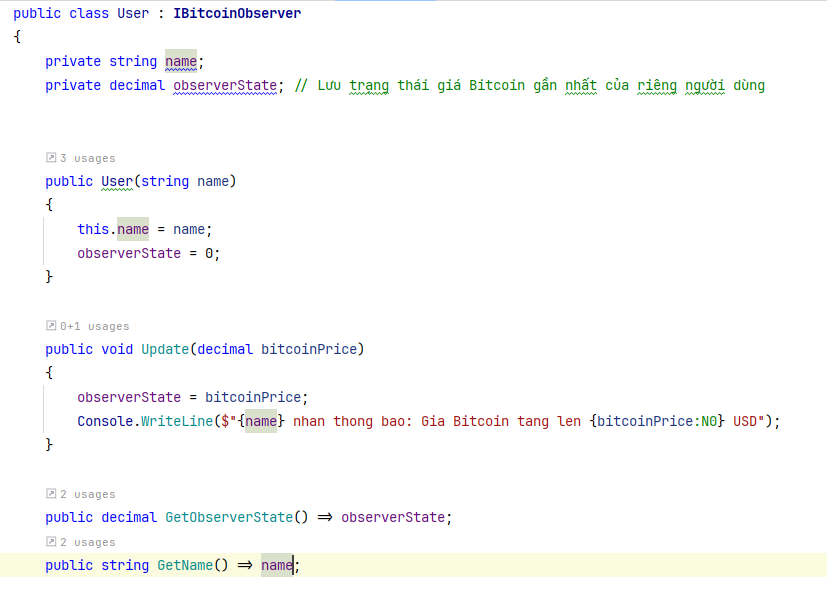
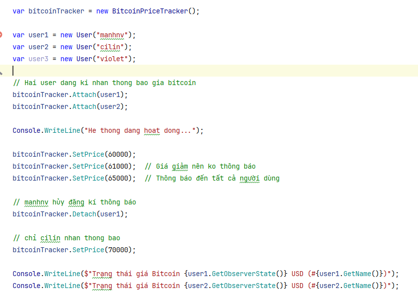
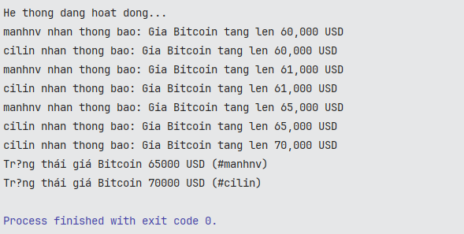

- [1. Khái niệm](#1-khái-niệm)
- [2. Cấu trúc](#2-cấu-trúc)
- [3. Thực hành](#3-thực-hành)
- [4. kết luận](#4-kết-luận)

# 1. Khái niệm

- observer pattern là một pattern thuộc nhóm Behavior (hành vi), giúp thiết lập mối quan hệ một-nhiều giữa các đối tượng, sao cho khi một đối tượng thay đổi trạng thái, tất cả các đối tượng phụ thuộc vào nó sẽ được thông báo và cập nhật tự động.
- Khi nào cần sử dụng:
  - Khi có một đối tượng (Subject) mà các đối tượng khác (Observers) cần theo dõi thay đổi trạng thái của nó.
  - Khi cần đảm bảo tính nhất quán giữa các thành phần mà không cần kết nối chặt chẽ giữa chúng (loose coupling).
- Ứng dụng thực tế:
  - Hệ thống sự kiện trong GUI (Windows Forms, WPF).
  - Mô hình MVC (Model-View-Controller) để cập nhật UI khi dữ liệu thay đổi.
  - Hệ thống thông báo (Push notifications).
  - Game Engine: Cập nhật trạng thái AI, vật lý...

# 2. Cấu trúc

- Gồm 4 phần chính
  - `Subject` (Observable): chủ thể quan sát
  - `ConcreteSubject`: Thực thể cụ thể của Subject
  - `Observer`: người quan sát
  - `ConcreteObserver` : thực thể cụ thể của Observer
- Chi tiết:
  - `Subject` :
    - là một abstract class hoặc interface
    - Cung cấp các phương thức:
      - Attach() -> Thêm một observer vào danh sách theo dõi
      - Detach() -> Xóa một observer
      - Notify() -> Gửi thông báo đến tất cả observer khi có sự thay đổi
    - `ConcreteSubject`
      - Lớp kế thừa từ Subject, chứa trạng thái thật sự của đối tượng mà các Observer quan tâm.
      - Khi trạng thái thay đổi, nó sẽ gọi Notify() để cập nhật tất cả Observer.
        - Biến subjectState -> Lưu trữ trạng thái của subject
        - GetState(): trả về trạng thái hiện tại
        - SetState(): cập nhật trạng thái mới và gọi Notify()
    - `Observer` :
      - Là một interface hoặc abstract class
      - Định nghĩa method Update(),giúp các observer phản hồi thì subject thay đổi
    - `ConcreteObserver`:
      - Kế thừa Observer
      - Biến observerState: Lưu trạng thái của observer
      - Method Update(): Lấy trạng thái từ subject và cập nhật chính nó

# 3. Thực hành

- Hệ thống theo dõi giá Bitcoin và thông báo cho user

  

  - Subject

  

  - ConcreteSubject

  

  

  - Observer

  

  - ConcreteObserver

  

  - Chương trình

    

    

# 4. kết luận

- Ưu điểm:
  - Giảm sự phụ thuộc giữa các đối tượng
    - Subject không cần biết chi tiết về Observer, chỉ biết rằng chúng có phương thức Update().
    - Điều này giúp dễ mở rộng hệ thống mà không cần sửa đổi nhiều code.
  - Có thể thêm/bớt Observer mà không ảnh hưởng đến Subject.
  - Thay đổi Subject không ảnh hưởng đến Observer, và ngược lại.
- Nhược điểm:
  - Có thể gây khó kiểm soát nếu có quá nhiều Observer -> chậm hệ thống
  - Nếu không gọi Detach() để xóa Observer khi không còn cần thiết, chúng vẫn sẽ nhận thông báo.
  - Nếu số lượng Observer ít hoặc Subject ít thay đổi, việc dùng Observer có thể không cần thiết.
