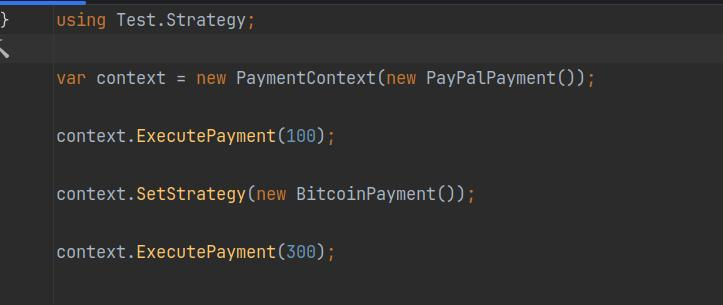

- [1. Khái niệm](#1-khái-niệm)
- [2. Cấu trúc](#2-cấu-trúc)
- [3. Thực hành](#3-thực-hành)
- [4. Kết luận](#4-kết-luận)

# 1. Khái niệm 
- Strategy Là một pattern thuộc nhóm Behavior (hành vi).  Pattern này cho phép định nghĩa nhiều thuật toán khác nhau trong một nhóm các lớp riêng biệt. Sau đó có thể dễ dàng thay đổi thuật toán sử dụng mà không làm thay đổi lớp đang sử dụng nó.
- Khi nào sử dụng:
  - Khi có nhiều thuật toán hoặc hành vi có thể hoán đổi cho nhau.
  - Khi muốn tách biệt logic thuật toán khỏi lớp chính, giúp mã dễ bảo trì hơn.
  - Khi cần giảm sự phụ thuộc giữa lớp chính và các thuật toán cụ thể.
- Dùng trong thực tế: Strategy Pattern có rất nhiều ứng dụng thực tế trong lập trình và phần mềm
  - Một trang web thương mại điện tử hỗ trợ nhiều phương thức thanh toán như thẻ tín dụng, PayPal, ví điện tử, chuyển khoản ngân hàng.
  -  Một ứng dụng cho phép người dùng tìm kiếm và sắp xếp danh sách sản phẩm theo nhiều tiêu chí như giá thấp nhất, đánh giá cao nhất, tên A-Z.
# 2. Cấu trúc

- Strategy: Là một interface hoặc abstract class định nghĩa method chung `AlgorithmInterface()`, mà tất cả các thuật toán (chiến lược) phải tuân theo

- ConcreteStrategyA, ConcreteStrategyB, ConcreteStrategyC (Các thuật toán cụ thể)
  - Mỗi lớp này kế thừa từ Strategy và triển khai thuật toán cụ thể của nó
  - Vi dụ:
    - ConcreteStrategyA có thể là thuật toán Sắp xếp nhanh (QuickSort).
    - ConcreteStrategyB có thể là thuật toán Sắp xếp chèn (InsertionSort).
    - ConcreteStrategyC có thể là thuật toán Sắp xếp nổi bọt (BubbleSort).

- Context: Là class tham chiếu đến một đối tượng Strategy, nó không quan tâm đến chi tiết triển khai của thuật toán mà chỉ gọi method AlgorithmInterface()
  

- Tóm lại: Context chứa một tham chiếu đến Strategy, ConcreteStrategyA, ConcreteStrategyB, ConcreteStrategyC kế thừa Strategy 
  
# 3. Thực hành 
- Ví dụ về hệ thống bán hàng hỗ trợ nhiều phương thức thanh toán khác nhau
  
  
  - Định nghĩa strategy
     
  - Các Concrete Strategy 
      
  - Định nghĩa context
    
  - Chương trình
     

# 4. Kết luận
- Lợi ích 
  - Tách biệt logic thuật toán ra khỏi lớp chính (PaymentContext)
  - Dễ mở rộng: Nếu muốn thêm phương thức thanh toán VNPay, Momo, chỉ cần tạo thêm ConcreteStrategy mới.
  - Dễ bảo trì: Không cần sửa đổi lớp PaymentContext, chỉ cần thay đổi hoặc thêm class mới triển khai IPaymentStrategy..
  - Linh hoạt: Có thể thay đổi thuật toán thanh toán tại runtime.
- Nhược điểm:
  - Tăng số lượng class – Mỗi thuật toán cần một class riêng, có thể làm code phức tạp.
  - Context phải biết về các Strategy – Nếu có quá nhiều chiến lược, việc chọn đúng chiến lược có thể trở nên phức tạp.

